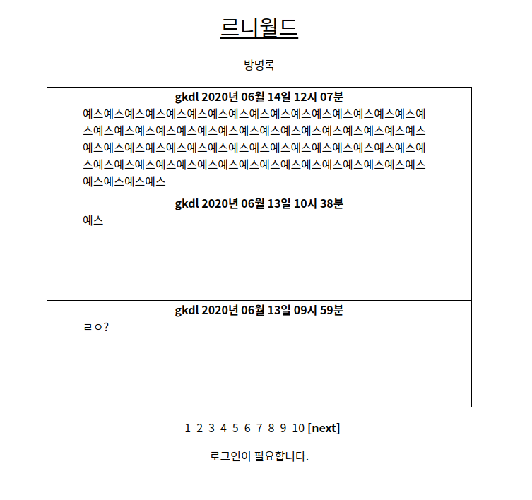

# leuniWorld (르니월드)

- Web 놀이터 (커뮤니티 웹)

## 구현된 기능

- 회원가입 & 로그인 & 로그아웃

- 실시간 채팅

- 방명록

## 설치 방법 (Installation)

- server 사용언어 - Typescript, Mysql, TypeORM
- client 사용언어 - Typescript, React
- [/server] DB - Mysql 설치가 필요헙니다.
- [/server] .env.example을 보고 .env파일을 새로 작성해야합니다.

## 사용법 (Usage)

- [/server] npm run dev
  > dev 서버 실행

* [/client] npm start
  > 클라이언트 실행

- [/server] npm run test
  > test코드 실행
